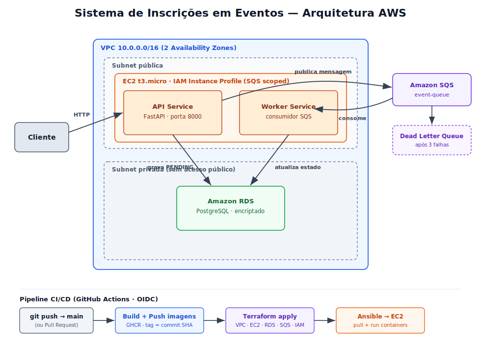

# Sistema de Inscrições em Eventos — Projeto Cloud

Trabalho final da unidade curricular **Sistemas de Informação na Nuvem**.

Aplicação distribuída e cloud-native que gere inscrições em eventos, implementada
na **AWS** com Infrastructure as Code (Terraform), containers Docker, comunicação
assíncrona via SQS e um pipeline CI/CD em GitHub Actions.

## Arquitetura (resumo)



O **API Service** recebe pedidos, grava a inscrição na base de dados (estado
`PENDING`) e publica uma mensagem na fila SQS. O **Worker Service** consome a
fila, valida a capacidade do evento e atualiza o estado para `CONFIRMED` ou
`REJECTED`. Mensagens que falham repetidamente vão para uma Dead Letter Queue.

Detalhe completo em [`docs/architecture.md`](docs/architecture.md).

## Tecnologias

AWS (VPC, EC2, RDS, SQS, IAM) · Terraform (módulos + remote state) · Docker ·
FastAPI / Python · Ansible · GitHub Actions (OIDC) · PostgreSQL

## Estrutura do repositório

```
.
├── app/              # Código da aplicação (api-service, worker-service) + dev local
├── terraform/        # Infraestrutura AWS em módulos
├── bootstrap/        # Backend remoto + OIDC (corre uma vez)
├── ansible/          # Configuração da EC2 e arranque dos containers
├── .github/workflows # CI (pr-check) e CD (deploy)
└── docs/             # Documentação técnica
```

## Início rápido

- **Desenvolvimento local** (sem custos AWS): ver [`app/README.md`](app/README.md)
- **Deploy na AWS**: ver [`docs/deployment.md`](docs/deployment.md)
- **Pré-requisitos e bootstrap**: ver [`docs/setup.md`](docs/setup.md)

## Documentação

| Documento | Conteúdo |
|-----------|----------|
| [architecture.md](docs/architecture.md) | Arquitetura, rede e fluxo de dados |
| [setup.md](docs/setup.md) | Pré-requisitos e bootstrap do backend/OIDC |
| [deployment.md](docs/deployment.md) | Deploy passo a passo e pipeline CI/CD |
| [security.md](docs/security.md) | IAM, secrets e segurança de rede |
| [limitations.md](docs/limitations.md) | Limitações e melhorias futuras |

## Autores

- Guilherme Ramalho
